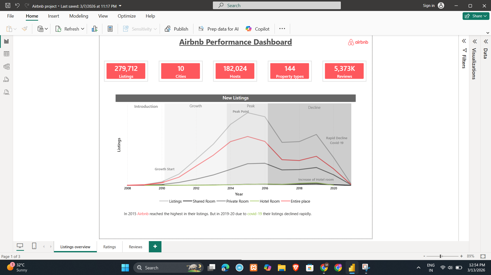
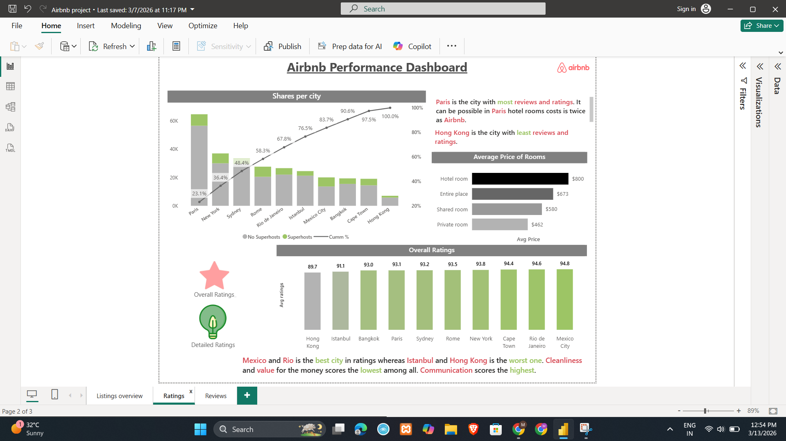
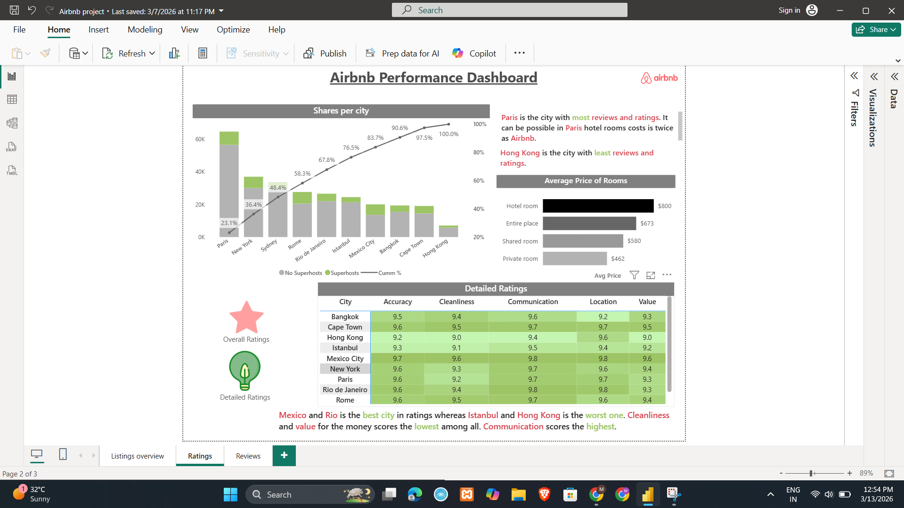
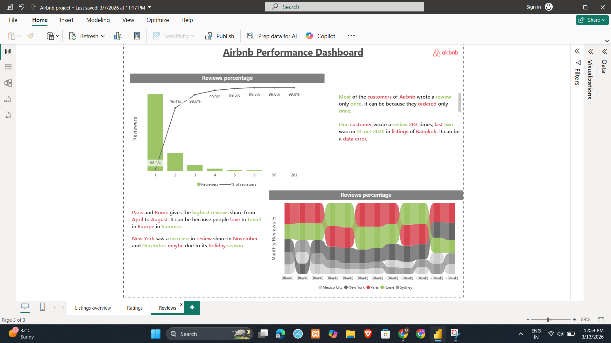

# Airbnb Data Analysis Dashboard (Power BI)
This project analyzes Airbnb listing data using Power BI to identify trends in pricing, property types, and reviewer behavior.

## Tools Used
- Power BI
- DAX
- Power Query

## Key Features
- Reviews per reviewer analysis
- Cumulative review distribution
- Interactive bookmarks for visual toggling
- Dynamic charts and KPIs

## Insights
The dashboard helps understand listing popularity, review engagement patterns, and pricing variations across property types.

## Dashboard Preview
### Overview

### Overall Ratings

### Detailed Ratings

### Reviews

Note: The dataset and Power BI (.pbix) file are not included due to file size limitations. Screenshots and project description are provided to demonstrate the dashboard analysis and insights.
